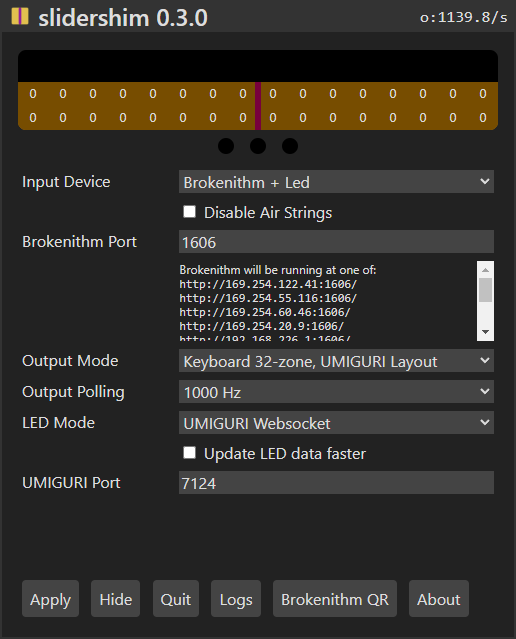
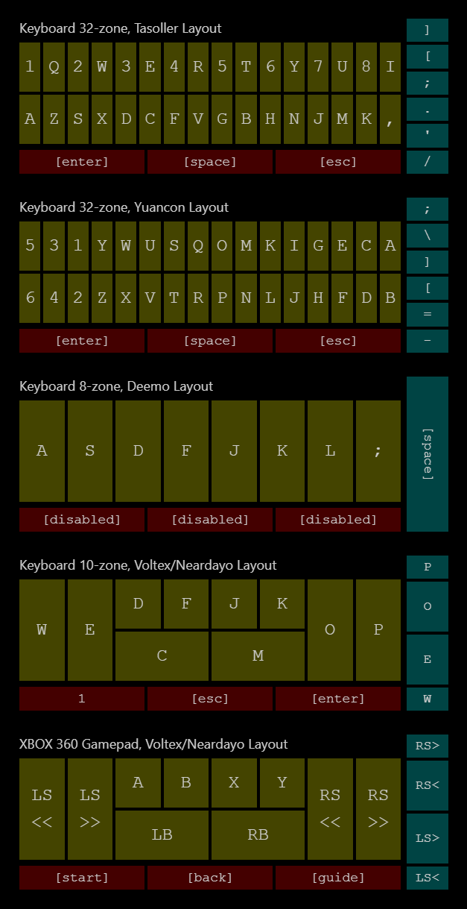

# slidershim

Software adapter for various Chunithm slider controllers with a built-in Brokenithm web controller. Has support for keyboard/gamepad output and LED lighting.

[Download link](https://github.com/4yn/slidershim/releases/latest)

## Setup Instructions

1. [Download here](https://github.com/4yn/slidershim/releases/latest)
2. Extract to any location you like.
3. Run `slidershim.exe`.
4. Pick your input device, output method and preferred lighting.
5. Click apply.
6. ???
7. Profit!

### Extra Pointers

- Less resources are used when the configuration window is hidden.
- Un-hide the configuration window from the system tray.
- For gamepad output, you will need to install [ViGEmBus](https://github.com/ViGEm/ViGEmBus/releases/latest) for it to work.
- For serial LED input, you may need to install [com0com](https://sourceforge.net/projects/com0com/files/com0com/2.2.2.0/) to bridge slidershim with the LED data stream.

### Brokenithm Setup

1. Set the device option to "Brokenithm" and apply.
2. Allow firewall access to `slidershim.exe`
3. Connect a touch device to the same wifi or local network as your windows machine
   > Windows hotspot works too, but make sure to give "public" firewall access
4. Open the web controller in your tablet device web browser. One of the links should work.
   1. Either manually type in the IP address if you know what IP it is;
   2. Or scan the generated "Broknenithm QR" to get a list of clickable links and save some typing.
5. (Optional) Add the webpage to home screen and/or enable guided access to avoid accidentally exiting the web controller.

## Output Layouts

Voltex layout disables air tower, Neardayo layout enables air tower.

## Troubleshooting

<strong>My controller is not recognised</strong>

- slidershim supports the GAMO2 Tasoller and Yuancon Laverita v2 controllers on HID firmware.
  - If you are using a Tasoller controller, make sure it has the correct HID firmware installed.
  - If your hardware controller is not one of these, it will not work.
- Hotplug is not supported. If you plugged in the controller after starting slidershim, re-connect your controller by just clicking the "Apply" button (even if it is grey).

<strong>I am using a controller and my keyboard buttons are pressed too often</strong>

- Adjust the sensitivity options.
- The higher the number, the harder it is for keyboard buttons to be pressed.

<strong>The Brokenithm controller cannot be loaded</strong>

- Make sure that you can load the controller in your web browser _from the same windows machine that is running slidershim_.
  - Close the windows machine web browser afterwards once you have tested it.
- Double check that your tablet device is connected to the same wifi or local network.
- Try restarting slidershim.

<strong>The Brokenithm controller is stuck</strong>

- Applying changes to the slidershim configuration will reset the brokenithm controller.
- Refresh the web page or force-stop the controller from your tablet device's task switcher and re-open the controller.

<strong>I am still having problems</strong>

- Join the [Cons&amp;Stuff Discord](https://discord.com/invite/zFGemg4r) and ping me there.
- Try to bring your logs.

<strong>Neardayo layout?</strong>

- [Neardayo layout.](https://youtu.be/8dA-RCSB-qA?t=25)

## Technical Information

- Built with Rust, [tauri](https://github.com/tauri-apps/tauri) + [Svelte](https://github.com/sveltejs/svelte), [rusb](https://github.com/a1ien/rusb), [vigem](https://github.com/ViGEm/ViGEmClient)[-client](https://github.com/CasualX/vigem-client), [hyper](https://github.com/hyperium/hyper/), [tokio-](https://github.com/snapview/tokio-tungstenite)[tungstenite](https://github.com/snapview/tungstenite-rs) and [serialport](https://crates.io/crates/serialport)
- USB device polling is done on a dedicated thread while everything else is done on a async runtime.

### Repository Layout

- [`public`](./public) / [`src`](./src): Svelte frontend
- [`src-tauri`](./src-tauri): Tauri adapter between frontend and backend
- [`src-slider_io`](./src-slider_io): Backend logic for handling usb, brokenithm, output emulation and lighting.
- [`res`](./res): Miscellaneous tools such as Brokenithm QR parser and keyboard layout visualisation.

## Planned Features

- Major:
  - Support AC slider serial protocol
  - Output and LED websocket adapters when UMIGURI comes out
- QOL:
  - Documentation
  - Comprehensive logging and error handling
