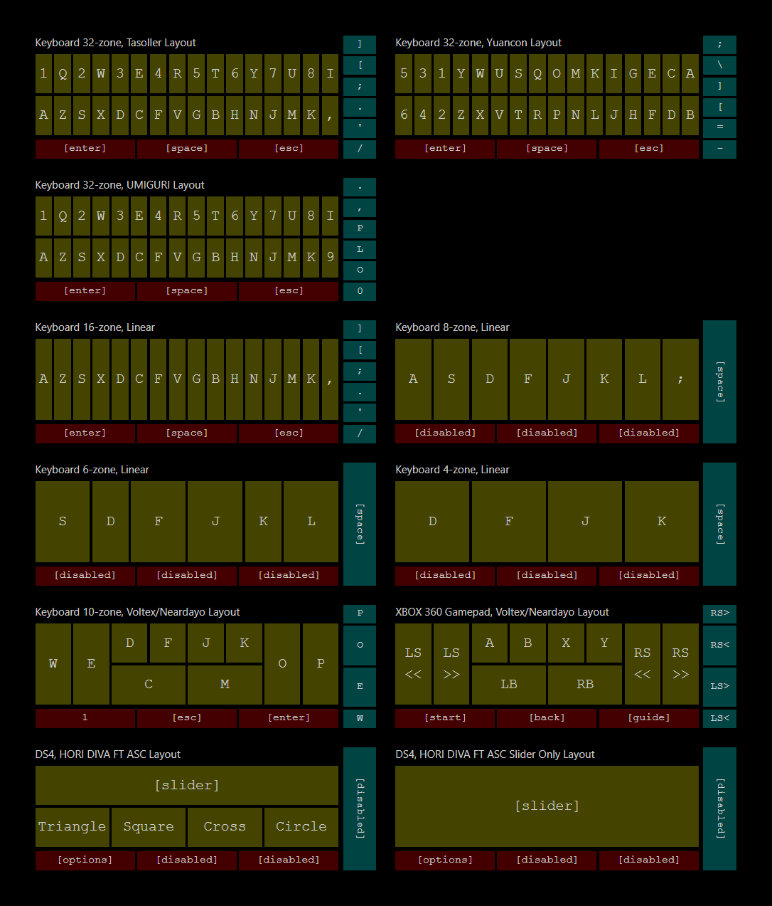

# [slidershim](https://github.com/4yn/slidershim)

Software adapter for various Chunithm slider controllers with a built-in Brokenithm web controller. Has support for keyboard/gamepad output and LED lighting. Requires Windows 8 or later.

[Download link](https://github.com/4yn/slidershim/releases/latest) | [Demo Video (Brokestalgia)](https://youtu.be/1PEtBP3cOew)

> Starting 0.2.0, there are reports that windows defender may block this software. You may need to disable windows defender the first time you run slidershim. If you are not comfortable with this, you can [download an older version here](https://github.com/4yn/slidershim/releases/tag/v0.1.4) that is known to be OK with windows defender.

## Changelog

- v0.2.5
  - Add 6k and 4k keyboard output options
  - Add settings for reactive LED colors
- v0.2.4
  - Restore support for older tablet devices for brokenithm by compiling brokenithm JS with older babel preset
  - Fix keys staying pressed even after brokenithm controller is closed
  - New Brokestalgia 28k web touch controller option
- v0.2.3
  - Fix first and last buttons not working with brokenithm
  - Add option to disable air strings for controllers
  - Add option to slow down lighting updates
- v0.2.2
  - Retcon serial slider name
  - Fix crash on some systems due to time math
  - Add link to repo
- v0.2.1
  - Reactive + Rainbow mode
  - Fixed byte order for serial slider lights
- v0.2.0
  - Added support for serial slider protocol
  - Added 16 key keyboard layout
- v0.1.4
  - Initial public release

## Setup Instructions

1. [Download here](https://github.com/4yn/slidershim/releases/latest)
2. Run the msi installer (recommended for first run) or extract zip to any location you like.
3. Run `slidershim.exe`.
4. Pick your input device, output method and preferred lighting.
5. Click apply.
6. ???
7. Profit!

### Extra Pointers

- Less resources are used when the configuration window is hidden.
- Un-hide the configuration window from the system tray.
- For gamepad output, you will need to install [ViGEmBus](https://github.com/ViGEm/ViGEmBus/releases/latest) for it to work.
- For serial LED input, you may need to install [com0com](https://sourceforge.net/projects/com0com/files/com0com/2.2.2.0/) to bridge slidershim with the LED data stream.

### Brokenithm Setup

1. Set the device option to "Brokenithm" and apply.
2. Allow firewall access to `slidershim.exe`
   > For more info on setting up firewall, check out [instructions at brokenithm-kb](https://github.com/4yn/brokenithm-kb#setup)
3. Connect a touch device to the same wifi or local network as your windows machine
   > Windows hotspot works too, but make sure to give "public" firewall access
4. Open the web controller in your touch device web browser. One of the links should work.
   1. Either manually type in the IP address if you know what IP it is;
   2. Or scan the generated "Broknenithm QR" to get a list of clickable links and save some typing.
5. (Optional) Add the webpage to home screen and/or enable guided access to avoid accidentally exiting the web controller.

## Output Layouts

Voltex layout disables air tower, Neardayo layout enables air tower.

## Troubleshooting

<strong>slidershim crashes when I am running it for the first time</strong>

- Use the .msi installer file instead of the .zip. You may be missing some windows addons that the installer will take care of (specifically Edge WebView).

<strong>My controller is not recognised</strong>

- slidershim supports the GAMO2 Tasoller and Yuancon Laverita v2 controllers on HID firmware.
  - If you are using a Tasoller controller, make sure it has the correct HID firmware installed.
  - If your hardware controller is not one of these, it will not work.
- If you have a device that communicates using serial protocol, chances are it will work with the "Slider over Serial" option
- Hotplug is not supported. If you plugged in the controller after starting slidershim, re-connect your controller by just clicking the "Apply" button (even if it is grey).

<strong>I am using a controller and my keyboard buttons are pressed too often</strong>

- Adjust the sensitivity options.
- The higher the number, the harder it is for keyboard buttons to be pressed.

<strong>Keyboard / XBOX Controller output feels sluggish</strong>

- Increase output polling rate. This does not change how fast your controller is updated, but it does reduce lag with keyboard / XBOX controller simulation.

<strong>The Brokenithm controller cannot be loaded</strong>

- Make sure that you can load the controller in your web browser _from the same windows machine that is running slidershim_.
  - Close the windows machine web browser afterwards once you have tested it.
- Double check that your tablet device is connected to the same wifi or local network.
- Try restarting slidershim.

<strong>The Brokenithm controller is stuck</strong>

- Applying changes to the slidershim configuration will reset the brokenithm controller.
- Refresh the web page or force-stop the controller from your tablet device's task switcher and re-open the controller.

<strong>slidershim 0.2.0 crashes right after I turn it on</strong>

- I'm not sure why this happens. I suspect some cases are because of windows defender and other antivirus software stopping the process while running.
- Try disabling antivirus or using an [older version of slidershim](https://github.com/4yn/slidershim/releases/tag/v0.1.4).

<strong>I am still having problems</strong>

- Join the [Cons&amp;Stuff Discord](https://discord.com/invite/zFGemg4r) and ping me there.
- Try to bring your logs.

<strong>Neardayo layout?</strong>

- [Neardayo layout.](https://youtu.be/8dA-RCSB-qA?t=25)

## Technical Information

- Built with Rust, [tauri](https://github.com/tauri-apps/tauri) + [Svelte](https://github.com/sveltejs/svelte), [rusb](https://github.com/a1ien/rusb), [vigem](https://github.com/ViGEm/ViGEmClient)[-client](https://github.com/CasualX/vigem-client), [hyper](https://github.com/hyperium/hyper/), [tokio-](https://github.com/snapview/tokio-tungstenite)[tungstenite](https://github.com/snapview/tungstenite-rs), [serialport](https://crates.io/crates/serialport), [dtolnay/cxx](https://github.com/dtolnay/cxx) and [wjwwood/serial](https://github.com/wjwwood/serial)
- USB device and serial polling is done on a dedicated thread while everything else is done on a async runtime.

### Building from Source

1. Install [Visual Studio Community 2019/2022](https://visualstudio.microsoft.com/vs/) with C++ developer kit
2. Install [rustup](https://rustup.rs/) with nightly toolchain
3. Install [node.js](https://nodejs.org/en/download/) and [yarn](https://www.npmjs.com/package/yarn)
4. (Optional) Setup [VSCode](https://code.visualstudio.com/) with [rust-analyzer](https://marketplace.visualstudio.com/items?itemName=matklad.rust-analyzer)
5. Clone this repository
6. (Optional) If using powershell, `Set-ExecutionPolicy -Scope Process -ExecutionPolicy Bypass` to whitelist `yarn` script
7. `yarn install`
8. `yarn tauri dev` / `yarn tauri build`

### Repository Layout

- [`public`](./public) / [`src`](./src): Svelte frontend
- [`src-tauri`](./src-tauri): Tauri adapter between frontend and backend
- [`src-slider_io`](./src-slider_io): Backend logic for handling usb, brokenithm, output emulation and lighting.
- [`src-wwserial`](./src-wwserial): FFI to [wjwwood/serial](https://github.com/wjwwood/serial) using [dtolnay/cxx](https://github.com/dtolnay/cxx). For some reason [serialport](https://crates.io/crates/serialport) does not work well with hardware devices, so we use this as an alternative.
- [`res`](./res): Miscellaneous tools such as Brokenithm QR parser and keyboard layout visualisation.

## Planned Features

- Major:
  - ✅ DONE: Support AC slider serial protocol
  - Output and LED websocket adapters when UMIGURI comes out
- QOL:
  - Documentation
  - Comprehensive logging and error handling
